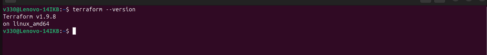
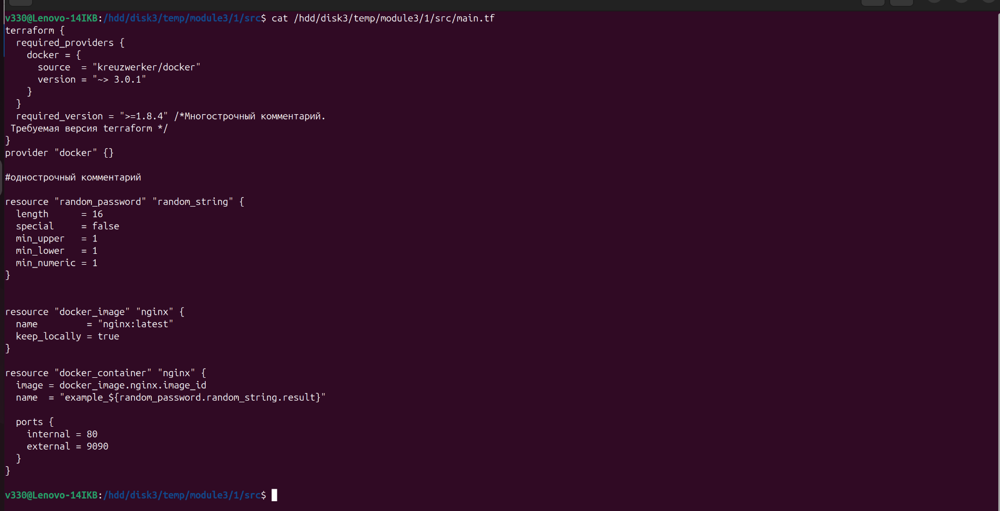
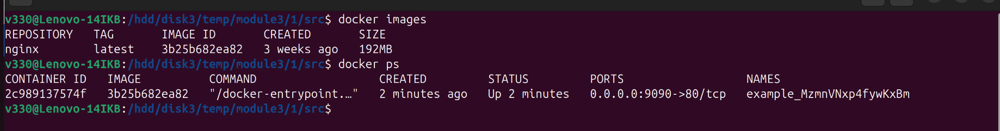
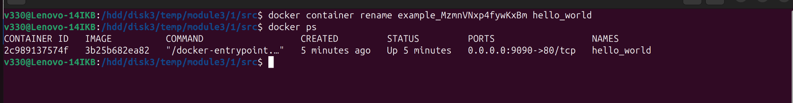
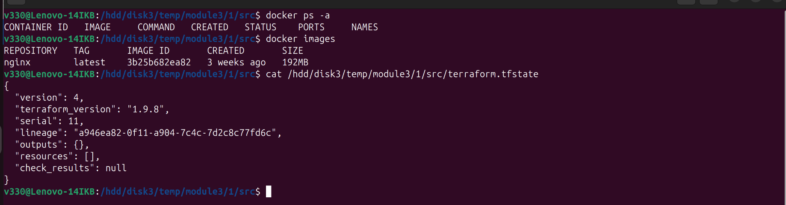
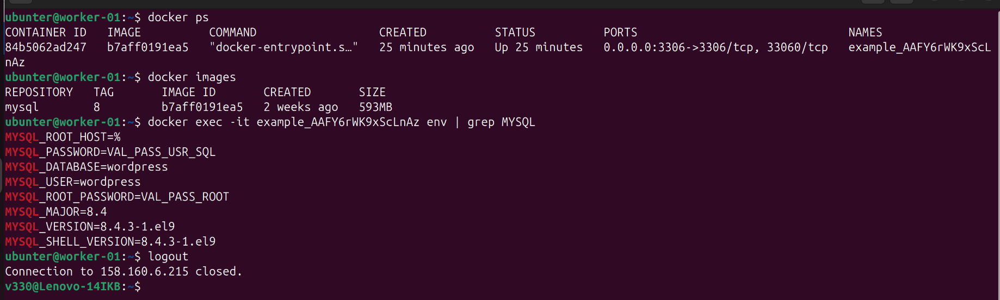
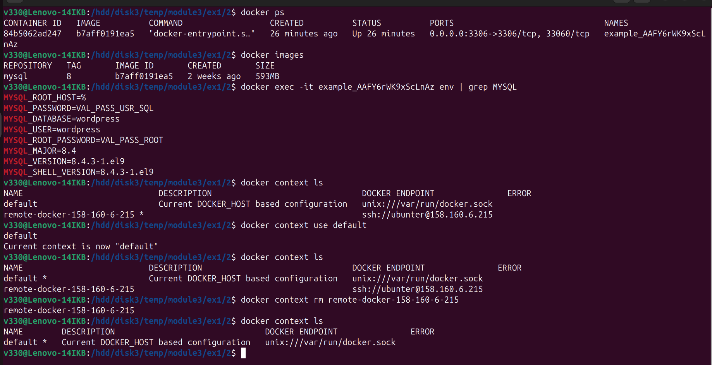

## Домашнее задание к занятию «Введение в Terraform»

### Задача 0  
Скриншот проверки Terraform  
  

***
### Задача 1  
2.  
согласно файлу src/.gitignore допустимо хранить секретную информацию в файлах, которые не попадут в git:
  - в файлах подкаталога .terraform/  
  - в любом файле проекта с началом названия .terraform, за исключением .terraformrc  
  - в любом файле проекта с расширением tfstate  
  - в любом файле проекта с любым расширением , с окончанием в названии .tfstate  
  - в файле personal.auto.tfvars - в этом файле рекомендуется хранить секретную информацию  

3.  
конкретный ключ и его значение ресурса random_password:  
```tf
"result": "MzmnVNxp4fywKxBm",
```
  
4.  
Ошибки  
1).  
  > 24: resource "docker_image" {  
  > All resource blocks must have 2 labels (type, name).  
  
Ответ:  
 Пропущено название ресурса блока  
2).  
  > 29: resource "docker_container" "1nginx" {  
  > A name must start with a letter or underscore and may contain only letters, digits, underscores, and dashes.  
  
Ответ:  
Название ресурса блока должно начинаться с буквы  
3).  
  > 31:   name  = "example_${random_password.random_string_FAKE.resulT}"  
  > A managed resource "random_password" "random_string_FAKE" has not been declared in the root module.  
  
4).  
  > 31:   name  = "example_${random_password.random_string.resulT}"  
  > This object has no argument, nested block, or exported attribute named "resulT".  
  
Ответ:  
Исправить название ресурса и его ключ в соответствии со значениями из файла terraform.tfstate  

5.  
Исправленный фрагмент кода
```tf
	resource "docker_image" "nginx" {
	  name         = "nginx:latest"
	  keep_locally = true
	}

	resource "docker_container" "nginx" {
	  image = docker_image.nginx.image_id
	  name  = "example_${random_password.random_string.result}"

	  ports {
	    internal = 80
	    external = 9090
	  }
	}
```

Скриншот фрагмент кода  
  

Скриншот docker ps  
  

6.  
При использовании ключа "-auto-approve" не запрашивает yes - ручного подтверждения перед применением изменений,
что может привести к случайному внесению серьезных изменения или даже удалить критически важные ресурсы.  

Скриншот docker ps  
  

7.  
Содержимое файла terraform.tfstate
```tf
{
  "version": 4,
  "terraform_version": "1.9.8",
  "serial": 11,
  "lineage": "a946ea82-0f11-a904-7c4c-7d2c8c77fd6c",
  "outputs": {},
  "resources": [],
  "check_results": null
}
```  

Скриншот файла terraform.tfstate  
  

8.  
Строчка из документации [terraform провайдера docker](https://docs.comcloud.xyz/providers/kreuzwerker/docker/latest/docs)   
> keep_locally (Boolean) If true, then the Docker image won't be deleted on destroy operation.  
> If this is false, it will delete the image from the docker local storage on destroy operation.  

Ответ в коде main.tf:   
`keep_locally = true` -это означает, что Terraform будет сохранять образ даже после выполнения команды destroy.  

Файлы и скриншоты по задаче можно посмотреть [здесь](1/)  

***
### Задача 2*
6.  
Скриншот на виртуальной машине  
  

Скриншот на локальном  
  

Файлы и скриншоты по задаче можно посмотреть [здесь](2/)  


